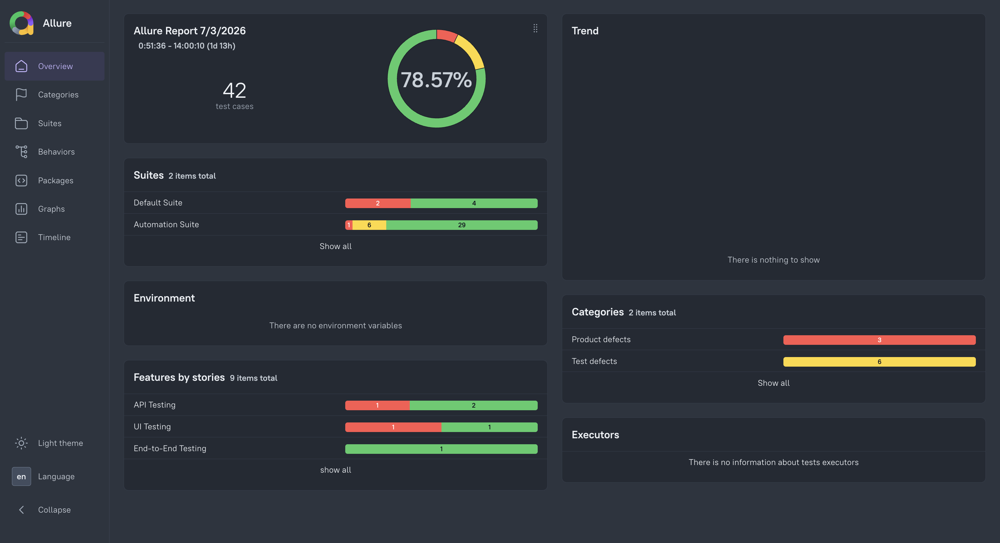
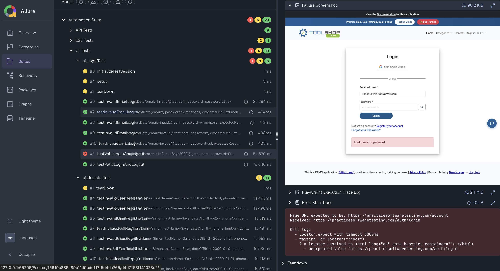

# E-Commerce Test Automation Framework

## Overview

This project demonstrates the design and implementation of a scalable Software Development Engineer in Test (SDET) automation framework following enterprise software engineering practices.

The framework provides a unified solution for:

- UI Automation
- API Automation
- End-to-End Testing
- Database Validation
- Parallel Execution
- Containerized Test Execution
- Continuous Integration
- Test Reporting

The primary objective is to build a maintainable, reusable, and extensible automation framework that reflects real-world enterprise testing practices.

## Tech Stack

* **Language**: Java 21
* **Build Tool**: Maven
* **UI Automation**: Playwright
* **API Testing**: REST Assured
* **Test Framework**: TestNG
* **Reporting**: Allure Report
* **JSON Mapping**: Jackson
* **Database**: JDBC
* **Logging**: Log4j2
* **Containerization**: Docker
* **CI/CD**: GitHub Actions

## Key Features
### UI Automation
- Playwright-based browser automation
- Page Object Model (POM)
- Cross-browser execution
- Data-driven testing
- Screenshot capture on failures

### API Automation
- REST Assured
- Reusable API client
- Request builders
- Response validation
- POJO serialization/deserialization
- Jackson object mapping

### End-to-End Testing
Integrated UI and API workflows.

### Database Validation
JDBC-based validation against relational databases.

Supports:
- Row count verification
- Schema validation
- Aggregate validation
- Data integrity checks
- Reporting

### Allure Reporting provides:
- Test execution summary
- Screenshots
- Stack traces
- Execution timeline
- Test categorization
- Historical trends

### Parallel Execution

Thread-safe framework using ThreadLocal.

Supports:
- Parallel class execution
- Multiple browser contexts
- Improved execution time
- Reduced resource contention

### CI/CD

GitHub Actions automatically: 

- Build project
- Execute tests
- Generate reports
- Publish artifacts 

### Docker Support
Containerized execution using:

- Docker
- Docker Compose

Ensures consistent execution across developer machines and CI environments.

## Framework Architecture

                  TestNG
                    │
        ┌───────────┼───────────┐
        │           │           │
       UI          API      Database
        │           │           │
    Playwright  REST Assured  JDBC
        │           │           │
        └───────────┼───────────┘
             Base Framework
                    |
          Configuration/Utilities
                    |
          Allure/Logging/Docker

## Project Structure
        ecommerce-sdet-framework
        │
        ├── src
        │   ├── main
        │   │   ├── java
        │   │   │   ├── base
        │   │   │   ├── builders
        │   │   │   ├── clients
        │   │   │   ├── config
        │   │   │   ├── constants
        │   │   │   ├── dataproviders
        │   │   │   ├── database
        │   │   │   ├── factories
        │   │   │   ├── handleres
        │   │   │   ├── listeners
        │   │   │   ├── models
        │   │   │   ├── pages
        │   │   │   └── utils
        │   │   │
        │   │   └── resources
        │   │       └── config.properties
        │   │
        │   └── test
        │       ├── java
        │       │   ├── api
        │       │   ├── database
        │       │   ├── e2e
        │       │   └── ui
        │       │
        │       └── resources
        │           ├── testdata
        │           └── testng.xml
        │
        ├── Dockerfile
        ├── docker-compose.yml
        ├── pom.xml
        └── README.md

## Framework Design Principles

The framework is designed around enterprise software engineering principles:

- Separation of concerns
- Single responsibility principle
- Reusable page objects
- Centralized configuration management
- Thread-safe execution
- Data-driven testing
- Layered API architecture
- Modular framework components

## Test Execution
### Execute All Tests
    mvn clean test  

### Execute UI Tests
    mvn clean test -DsuiteXmlFile=testng-ui.xml

### Execute API Tests
    mvn clean test -DsuiteXmlFile=testng-api.xml

### Execute End-to-End Tests
    mvn clean test -DsuiteXmlFile=testng-e2e.xml

## Running with Docker (Containerization)

### Build Docker Image
    docker build -t ecommerce-framework .

### Run Container
    docker run --rm ecommerce-framework

### Run Using Docker Compose (Recommended)
    docker compose up --build

### Stop Containers
    docker compose down

## Allure Reporting
    allure serve allure-results

### Failed Test Evidence
